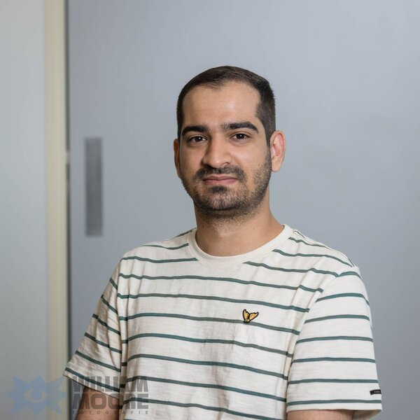
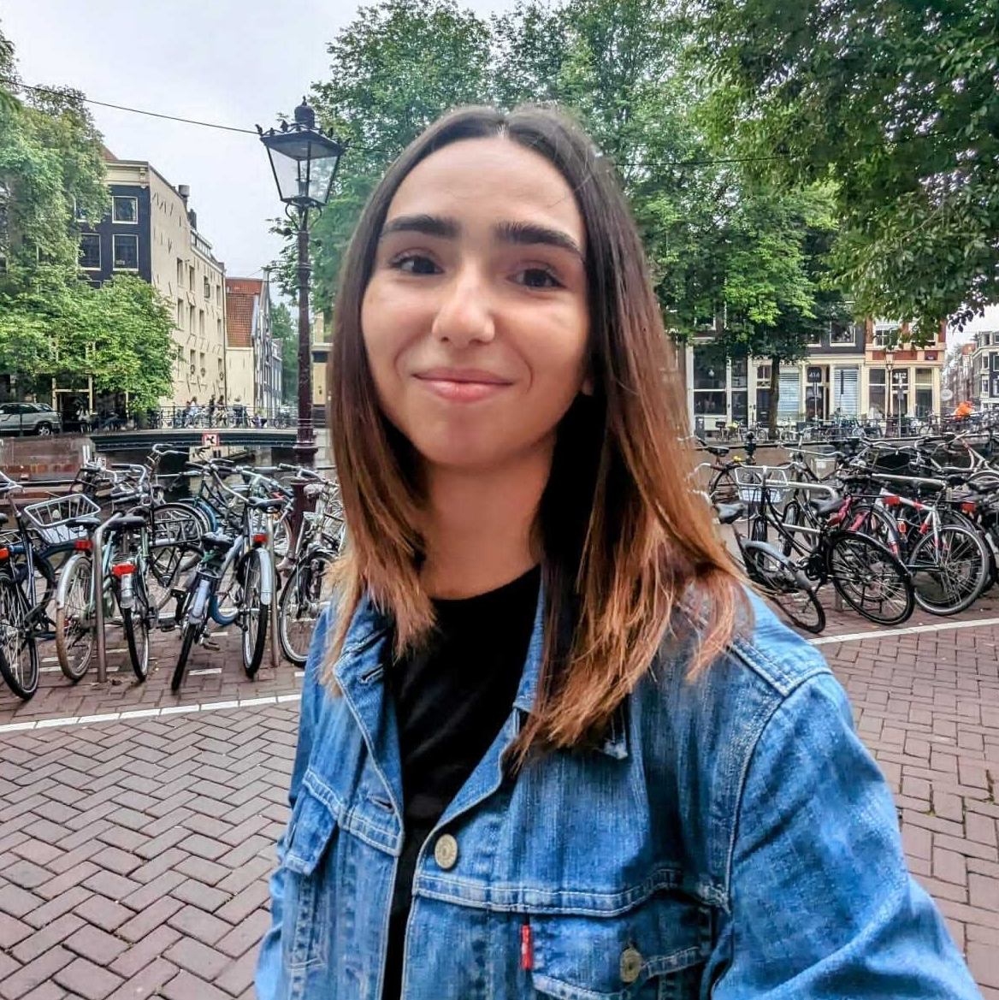
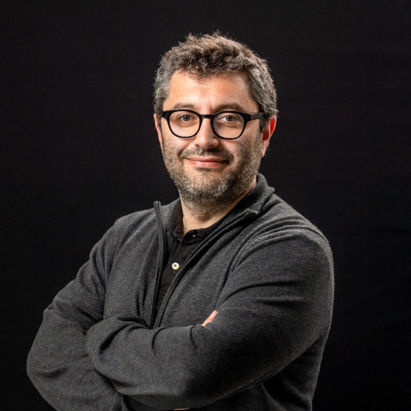
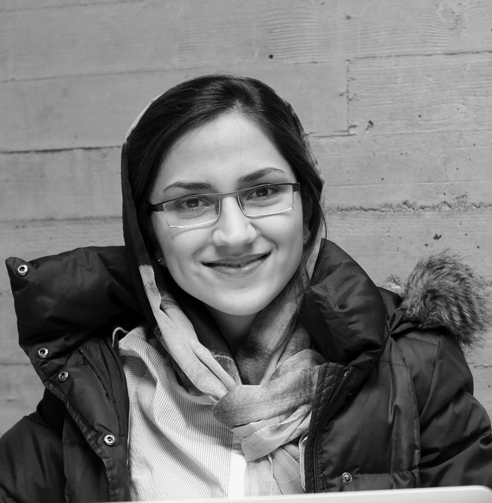

### Presenters
<table style="border: none;">
<tr style="border: none;">
<td align="center" style="width: 200px;" >

</td>
<td align="center" style="width: 200px;">

</td>
<td align="center" style="width: 200px;">

</td>
<td align="center" style="width: 200px;">

</td>
</tr>
<tr  style="border: none;">
<td align="center">
<b><a href="https://scholar.google.com/citations?user=PKdMg1AAAAAJ&hl=en&oi=ao" style="color:#51247a;">Heydar Soudani</a></b>
</td>
<td align="center">
<b><a href="https://scholar.google.com/citations?user=uVfPg-cAAAAJ&hl=en" style="color:#51247a;">Roxana Petcu</a></b>
</td>
<td align="center">
<b><a href="https://scholar.google.com/citations?user=0HybxV4AAAAJ&hl=en" style="color:#51247a;">Evangelos Kanoulas</a></b>
</td>
<td align="center">
<b><a href="https://hasibi.com/" style="color:#51247a;">Faegheh Hasibi</a></b>
</td>
  
</tr>
</table>

#### Bio

<b>Heydar Soudani</b> is a first-year Ph.D. student at Radboud University's Institute of Computing and Information Sciences (iCIS), where he is being supervised jointly by Faegheh Hasibi and Evangelos Kanoulas. He holds a Bachelor's degree from Polytechnic of Tehran and a Master's degree from Sharif University of Technology. His research primarily focuses on conversational systems in low-resource domains and languages. Specifically, he is dedicated to the development of knowledge-grounded models that generate synthetic multi-turn conversation data.

<b>Roxana Petcu</b> is a starting Ph.D. student at the University of Amsterdam (UvA), supervised by prof Evangelos Kanoulas and dr Faegheh Hasibi. She completed her master's degree in Artificial Intelligence at UvA and obtained a BSc in Computer Science at Vrije University (Amsterdam). Her research focuses on data augmentation and generation for conversational agents. Her interests and previous experience also include speech recognition models, graph neural networks, and low-resource optimization.

<b>Evangelos Kanoulas</b> is a full professor of computer science at the University of Amsterdam, leading the Information Retrieval Lab at the Informatics Institute. His research lies in developing evaluation methods and algorithms for search, and recommendation, with a focus on learning robust models of language that can be used to understand noisy human language, retrieve textual data from large corpora, generate faithful and factual text, and converse with the user. Prior to joining the University of Amsterdam, he was a research scientist at Google and a Marie Curie fellow at the University of Sheffield. His research has been published at SIGIR, CIKM, WWW, WSDM, EMNLP, ACL, and other venues in the fields of IR and NLP. He has proposed and organized numerous search benchmarking competitions as part of the Text Retrieval Conference (TREC) and the Conference and Labs of the Evaluation Forum (CLEF). Furthermore, he is a member of the Ellis society (https://ellis.eu/).

<b>Faegheh Hasibi</b> is an assistant professor of information retrieval at the Institute of Computing and Information Sciences (iCIS) at Radboud University. Her research interests are at the intersection of Information Retrieval and Natural Language Processing, with a particular emphasis on conversational AI and semantic search systems. She explores various aspects, including knowledge-grounded conversational search, entity linking and retrieval, and the utilization of knowledge graphs for semantic search tasks. Her contributions to the field are published in renowned international conferences such as SIGIR, CIKM, COLING, and ICTIR and have been recognized by awards at the SIGIR and ICTIR conferences. She has given mutilple invited talks and has extensive experience as a lecturer. 

